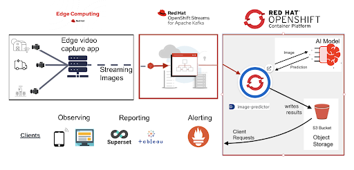

# What this lab covers
The labs is intended to showcase the capability of RH components, and how these components can be composed to provide modern applications.
The application here is an example of predictive maintenance system which collects data from edge and analyse it for anomalies. 
The aim of this lab are as follows
- Show how RH Managed service offerings make application lifecycle faster and scalable
- Show how RH Data Science makes it easy to build and deploy models.
- How different components works together to solve a business problem.
The application first collects data from the edge devices such as cameras and send the raw data to the AMQ Streams. A consumer to the stream will perform inference and generate alerts.
Data Science team use the platform to build (and re-train) and deploy the model in self-serving fashion.

# Technical Architecture

# How to run this lab
- Have an OCP cluster. If you a Red Hat employee or partner, you can use RHPDS
- To set up, see instructions in docs/setup.md
- To run inference demo, see instructions in 
- To train a new model to use in the inference demo, see instructions in 
  
