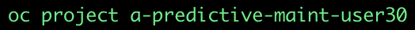

# Setting up the Inference Demo


### Prerequisite 1 - Download the edge-based virtual box. 
This virtual machine, contains all of the libraries, binaries, command line interfaces etc, that you'll need to 
- interact with, setup and configure your Kafka Streaming service
- interact with, setup and configure your OpenShift based applications, which will - 
  - make the inference calls to the AI prediction service using pulled in realtime from your Kafka Streaming service
  - push the results to your own OpenShift based Object Store S3 implemenation
- retrieve images from your webcam feed in realtime and push them to your Kafka Streaming service

Your instructor will paste URL from which you pull the virtual box in the web meeting chat. Open that URL to begin the download.


### Prerequisite 2 - a Red Hat Account
Next, if you don't already have one, set up a free Red Hat Account - where the SaaS service, Red Hat OpenShift Service for Apache Kafka (RHOASAK) is located. Do that at **https://console.redhat.com**. Logout


### Prerequisite 3 - an OpenShift cluster, a Username and an OpenShift project to work in
You instrutor will supply these to you in the Web Meeting Chat. We'll refer to these below as
```
OPENSHIFT_CLUSTER_URL
YOUR_OPENSHIFT_USERNAME
YOUR_OPENSHIFT_INFERENCE_PROJECT
```
Once these there are complete, you're ready to begin. 

## 1 - Open a terminal inside your virtual box. 

Open a terminal in the virtual box. 
# TODO INSTRUCTIONS TO GET A COMMAND WINDOW IN THE VIRTUAL BOX


## 2 - Download this Github repository, for your source code, scripts, yaml etc

Using the example below:   
1. Clone (or fork) this repo.
2. Change directory into the root directory of the cloned repository **predictive-maint**.  
3. Create a variable *REPO_HOME* for this directory

```
git clone https://github.com/odh-labs/predictive-maint.git
cd predictive-maint
export REPO_HOME=`pwd`
```


## 3 - Setup Kafka Cluster on Red Hat OpenShift Streams for Apache Kafka (RHOSAK)
In this section, we're going to automate the configuration of your Kafka streaming service and slot the values from ***your*** new Kafka configuration into various source files so they're ready to use later. Your Kafka streaming service is where
 - images will be sent from your laptop in realtime
 - those same images will be pulled in realtime for your inferencing application on OpenShift


Now, using a terminal inside your virtual box, run the following Kafka automation script
```
cd $REPO_HOME/deploy
. ./kafka.sh
```

You'll be prompted login to your Red Hat Account (you set up previosly). A confirmation page like the following will appear on your browser
 

... as well as confirmation on the terminal:


This script will take several minutes to complete. Keep the terminal open, allowing it to continue the Kafka configuration. 
Feel free to move to the section below ***4 - Configure OpenShift based object storage (Minio) and model serving (Seldon)*** - and come back to the script after 10 minutes


#### Confirm your Kafka installation
Come back in 10 minutes to check it has completed successfully.
i.e. do the following:
- Scan your terminal output - it should have run to completion with no errors.
- You'll need to record 2 items of data in your terminal output. Towards the end of the output, just before the section ***The following ACL rules will be created***, your client id and secret appear. Copy these 2 items - we'll refer to them as ***SASL_USERNAME*** and ***SASL_PASSWORD*** below. 
- navigate to [https://console.redhat.com/application-services/streams/kafkas](https://console.redhat.com/application-services/streams/kafkas)
and drill into your new ***kafka-rocks*** Kafka cluster and see a new Topic ***video-stream***, and configuration under the Access tab have been added.


#### Get your Kafka Bootstrap server details

- Navigate to **Application and Data Services > Streams for Kafka > Kafka Instances**, (or just hit [https://console.redhat.com/application-services/streams/kafkas](https://console.redhat.com/application-services/streams/kafkas)). 
- Select the Kafka instance you created earlier (in my case tom-kafka), select the Kebab menu
- Click Details: 


- Click the Connection tab and copy your *Bootstrap server*. We'll refer to this below as YOUR_KAFKA_BOOTSTRAP_SERVER (in my case *tom-kafka-cbdk-spfgjklbiqle--a.bf2.kafka.rhcloud.com:443*)


## 4 - Configure OpenShift based object storage (Minio) and model serving (Seldon)

#### Login to your OpenShift cluster 
1. Log on to OpenShift - by hitting the URL ***OPENSHIFT_CLUSTER_URL*** you got off the Web Meeting Chat earlier. You'll see this screen. Click **openshift-users** 

2. Enter these values and click **Log On**   
   - the value for ***YOUR_OPENSHIFT_USERNAME*** you got earlier for your username
   - ***openshift*** for your password 
  


3. Click the *Perspective* dropdown list box
4. Click the *Administrator* perspective\
   OpenShift changes the user interface to the Adminstrator perspective.

5. Click your username on the top right of the screen, then click *Copy Login Command*

6.  Login again with your credentials, Click **Display Token**, copy and paste the token into a terminal window (accepting any insecurity warning)

Separately, keep a note of the 2 values for
     - OPENSHIFT_API_LOGIN_TOKEN
     - OPENSHIFT_API_LOGIN_SERVER
   You'll need them for the training demo/workshop below

7. Copy the entire ***oc login*** command as far as ***6443*** and paste into your terminal window inside virtual box. Accept the *insecurity* warning

#### Install the Seldon Deployment

Seldon is an awesome tool to expose the model behind a RESTful API.

1. First you'll need to select your project inside the terminal window. Run the following replacing ***YOUR_OPENSHIFT_INFERENCE_PROJECT*** with yours
   ```
   oc project <insert YOUR_OPENSHIFT_INFERENCE_PROJECT here>
   ```
   i.e. in my case, as I'm user30:

 

2. Run the following
  ```
   oc apply -f $REPO_HOME/deploy/Seldon-Deployment.yaml
   ```

3. Now let's verify this Seldon deployment you just did on the OpenShift web console. First, click your new project on the GUI


# TODO - RESUME HERE


3. Click **Operators > Operator Hub** (ensuring your project is selected on top - though ypur project name will probably be different)
   
   OpenShift displays the operator catalogue.  
4.  Click the *Filter by keybord* text box and type *seldon*  
   OpenShift displays the *Seldon* tile.
5. Click the **Community Seldon Operator**  
   OpenShift displays a Commmunity Operator warning dialog box.
   
6. Click **Continue**  
   OpenShift displays a community operator warning. Accept it by clicking *Continue*.
7. OpenShift displays the operator details. Click **Install**   
      
8. OpenShift prompts for the operator configuration details. Accept all defaults and click **Install**\
 
   OpenShift installs the operator and displays a confirmation box once complete a few minutes later.  
9. Click **Installed Operators**, ensuring your new project is selected on top. See the installation has succeeded. Click **Seldon Operator** 
 

10. Click **Seldon Deployment** then **Create Seldon Deployment**
 

11. On your laptop (or wherever you cloned this repositiory above), navigate to and copy the entire contents of the file **deploy > Seldon-Deployment.yaml**
 

12. Back on OpenShift, choose **YAML view** and replace the default YAML with what you copied in the previous step. Click **Create**
 
 A few minutes this should be complete. We have configured this so approximately 20 pods are instantiated. This is to ensure the AI program responds very quickly to changing images sent from your laptop.

### Install Minio, our lightweight Object Storage implementation


1. In your terminal window, type the following commands:
   ```
   oc apply -f $REPO_HOME/deploy/minio-full.yaml
   ```


### Setup your Minio Object Storage

## Get your Minio URL (Route)
1. In OpenShift, move to **Workloads > Pods**. After a few minutes, both your Minio and Seldon pods should be Running and Ready. (ignore any initial errors for the first couple of minutes - they will work themselves out)


2. Navigate back to **Networking > Routes**. Take a note the OpenShift Route for 
   - the first Minio Route (i.e. the one without ***ui***)


1. We'll need to take note of
   - FULL_MINIO_API_ROUTE - which is your *Minio API Route* from the previous step ***WITH*** the HTTP protocol
   ```
   FULL_MINIO_API_ROUTE
   http://minio-ml-workshop-a-predictice-maint.apps.cluster-spvql.spvql.sandbox67.opentlc.com
   ```
   - MINIO_API_URL - which is your *Minio API Route* from the previous step - ***WITHOUT*** the HTTP protocol
   ```
   YOUR_MINIO_API_URL
   minio-ml-workshop-a-predictice-maint.apps.cluster-spvql.spvql.sandbox67.opentlc.com

## 5 - Record your Environment Variables
When you later run 
1. your edge based webcam image retrieval client
2. your OpenShift based inference service

you'll need to configure each with various ENVIROMENT variables.

They're summarised here in a generalised format:
```
SASL_USERNAME="<SASL_USERNAME recorded above>"
SASL_PASSWORD="<SASL_PASSWORD recorded above>"
KAFKA_BROKER="<YOUR_KAFKA_BOOTSTRAP_SERVER recorded above>"
MINIO_SERVER="<YOUR_MINIO_API_URL recorded above>"
```

Take a note of these four values, that are specific to you as a user. We'll refer to these as ***YOUR_ENVIRONMENT_VARIABLES***


## 6 - Setup Client Application to capture real-time images from your webcam

# TODO - REPLACE WITH VIRTUAL BOX

We need to set up the application on your laptop that captures images in realtime from your webcam and pushes them to the ***video-stream*** Kafka topic you created earlier - from which the inferencing application will pull them.

Now change directory to the *event-producer* directory in the repo code cloned at the beginning.
```
cd $REPO_HOME/event-producer
```

The final thing you'll need to do before running your client is export five of ***YOUR_ENVIRONMENT_VARIABLES*** from above. Just place the export command in front of each and hit enter. 
```
export SASL_USERNAME="<SASL_USERNAME recorded above>"
export SASL_PASSWORD="<SASL_PASSWORD recorded above>"
export KAFKA_BROKER="<YOUR_KAFKA_BOOTSTRAP_SERVER recorded above>"
```
i.e. in my case:


Now your client is ready. We'll use it in the next instruction file, [Run End to End Inference Demo](https://github.com/odh-labs/predictive-maint/blob/main/docs/image-detection-inference-demo.md)


## 7 - Configure your OpenShift inference application to pull images from RHOSAK and make realtime predictions

We have a simple OpenShift based application that 
- pulls images from our video-stream Kafka topic we set up earlier
- for each one, it calls the Model via the MODEL_URL value above (always http://model-1-pred-demo:8000/api/v1.0/predictions) for a prediction on what the image contains
- writes the count of what it found out to our Object Storage Minio
  
We simply need to configure it ***YOUR_ENVIRONMENT_VARIABLES*** that you set up previously.

On your laptop, open the file *consumer-deployment.yaml* in the in *deploy* directory the repo code cloned at the beginning. Move down to line 45 where you'll see placeholders for these 4 values (i.e.  ***YOUR_ENVIRONMENT_VARIABLES*** above). Fill them in and **Save the file** (e.g. as shown with mine - obviously your actual values will be different).


## 8 - Configure your simple HTML dashboard that records a count of the objects it sees

We have a simple HTML page that polls our Minio Object Storage bucket for the count of how many of each item the AI has recorded.

It's this file
```
$REPO_HOME/deploy/show_data.html
```

Open the file using a text editor and change line 7.


i.e. replace ***CHANGE_ME_FULL_MINIO_API_ROUTE*** with your ***FULL_MINIO_API_ROUTE*** retrieved above
```
'[CHANGE_ME_FULL_MINIO_API_ROUTE]/image-prediction/'
```
... in my case 


Now your inference application is ready. We'll use it in the next instruction file, [Run End to End Inference Demo](https://github.com/odh-labs/predictive-maint/blob/main/docs/image-detection-inference-demo.md)
