# Setting up the Inference Demo

## 1 - Download the OpenShift CLI

Navigate to [OpenShift CLI Download Page](https://docs.openshift.com/container-platform/4.10/cli_reference/openshift_cli/getting-started-cli.html). (use the newest version - selectable on the top of the page)

Follow the instructions to download the ***oc*** client and add it to your system path.

## 2 - Download the Workshop Files

Using the example below:   
1. Clone (or fork) this repo.
2. Change directory into the root directory of the cloned repository **predictive-maint**.  
3. Create a variable *REPO_HOME* for this directory

```
git clone https://github.com/odh-labs/predictive-maint.git
cd predictive-maint
export REPO_HOME=`pwd`
```


## 3 - Setup Kafka Cluster on Red Hat OpenShift Streams for Apache Kafka (RHOSAK)
In this section, we're going to automate the configuration of your Kafka streaming service
 - to which images will be sent from your laptop in realtime
 - and from which those images will be pulled for your inferencing application on OpenShift, also in realtime.

First, run this to download the Red Hat OpenShift Application Services (RHOAS) Command Line Interface (CLI)
```
cd $REPO_HOME
curl -o- https://raw.githubusercontent.com/redhat-developer/app-services-cli/main/scripts/install.sh | bash
```

You should see a confirmation message, including the location the CLI was installed to:


Next, you need to add that to your path - e.g. on a Mac:
```
export PATH=%PATH%:/Users/<INSERT YOUR USERNAME HERE>/bin
```
in my case:


Next, if you don't already have one, set up a free Red Hat Account - where the SaaS service, Red Hat OpenShift Service for Apache Kafka (RHOASAK) is located. Do that at **https://console.redhat.com**. Logout

Now, using the RHOAS CLI in a terminal on your laptop, login to your Red Hat SaaS service, by running the following, entering your credentials just created, and following the instructions to login.
```
rhoas login
```
i.e. A browser should pop up, prompting you to login again to **https://console.redhat.com**. 
Login using your *console.redhat.com* credentials

A confirmation page like the following will appear on your browser
 

... as well as confirmation on the terminal:
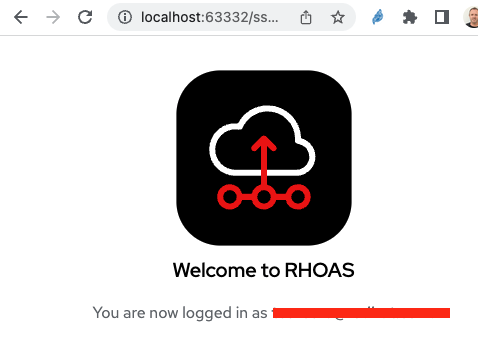

In the same terminal on your laptop, navigate to the deploy folder in this repository and run the kafka configuration shell script
```
cd $REPO_HOME/deploy
sh kafka.sh
```
This will take several minutes. Keep the terminal open, allowing it to continue the Kafka configuration. 

### Confirm your Kafka installation
Come back in 10 minutes to check it has completed successfully.
i.e. do the following:
- Scan your terminal output - it should have run to completion with no errors.
- You'll need to record 2 items of data in your terminal output. Towards the end of the output, just before the section ***The following ACL rules will be created***, your client id and secret appear. Copy these 2 items - we'll refer to them as ***SASL_USERNAME*** and ***SASL_PASSWORD*** below. 
- navigate to [https://console.redhat.com/application-services/streams/kafkas](https://console.redhat.com/application-services/streams/kafkas)
and drill into your new ***kafka-rocks*** Kafka cluster and see a new Topic ***video-stream***, and configuration under the Access tab have been added.


### Get your Kafka Bootstrap server details

- Navigate to **Application and Data Services > Streams for Kafka > Kafka Instances**, (or just hit [https://console.redhat.com/application-services/streams/kafkas](https://console.redhat.com/application-services/streams/kafkas)). 
- Select the Kafka instance you created earlier (in my case tom-kafka), select the Kebab menu
- Click Details: 


- Click the Connection tab and copy your *Bootstrap server*. We'll refer to this below as YOUR_KAFKA_BOOTSTRAP_SERVER (in my case *tom-kafka-cbdk-spfgjklbiqle--a.bf2.kafka.rhcloud.com:443*)
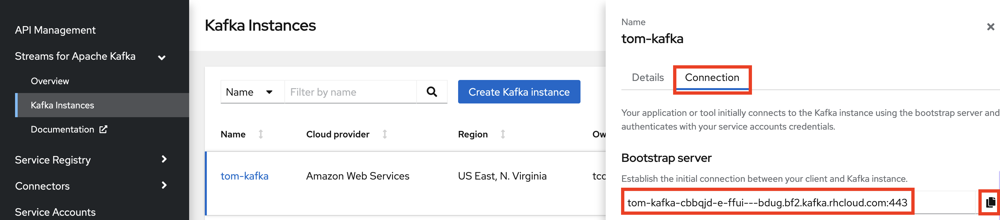


## 4 - Configure OpenShift based object storage (Minio) and model serving (Seldon)

### Login to your OpenShift cluster 
1. Log on to OpenShift as a Cluster Administrator. (For RHPDS this is opentlc-mgr.)
2. Click the *Perspective* dropdown list box
3. Click the *Administrator* perspective\
   OpenShift changes the user interface to the Adminstrator perspective.

4. Click your username on the top right of the screen, then click *Copy Login Command*

5.  Login again with your credentials, Click **Display Token**, copy and paste the token into a terminal window (accepting any insecurity warning)
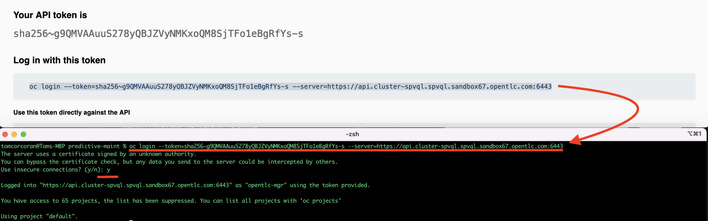
Separately, keep a note of the 2 values for
 - OPENSHIFT_API_LOGIN_TOKEN
 - OPENSHIFT_API_LOGIN_SERVER
You'll need them for the training demo/workshop below

### Install the Seldon Operator and Seldon Deployment

The Seldon operator is required to expose the model behind a RESTful API.

1. Create a new project using the terminal and delete any limits that get applied to your project. 
***NOTE ask your instructor what your USER value should be***
```
export USER=<ASK INSTRUCTOR>
oc new-project a-predictive-maint-$USER
oc delete limits a-predictive-maint-$USER-core-resource-limits
```
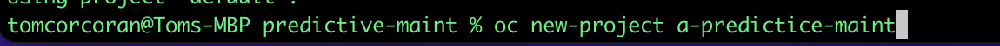

2. Click your new project on the GUI
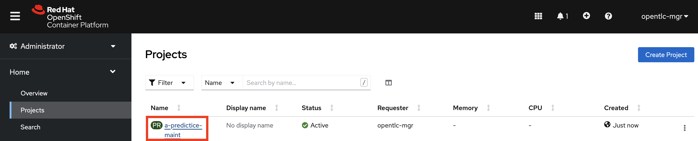
3. Click **Operators > Operator Hub** (ensuring your project is selected on top - though ypur project name will probably be different)
   
   OpenShift displays the operator catalogue.  
4.  Click the *Filter by keybord* text box and type *seldon*  
   OpenShift displays the *Seldon* tile.
5. Click the **Community Seldon Operator**  
   OpenShift displays a Commmunity Operator warning dialog box.
   
6. Click **Continue**  
   OpenShift displays a community operator warning. Accept it by clicking *Continue*.
7. OpenShift displays the operator details. Click **Install**   
      
8. OpenShift prompts for the operator configuration details. Accept all defaults and click **Install**\
 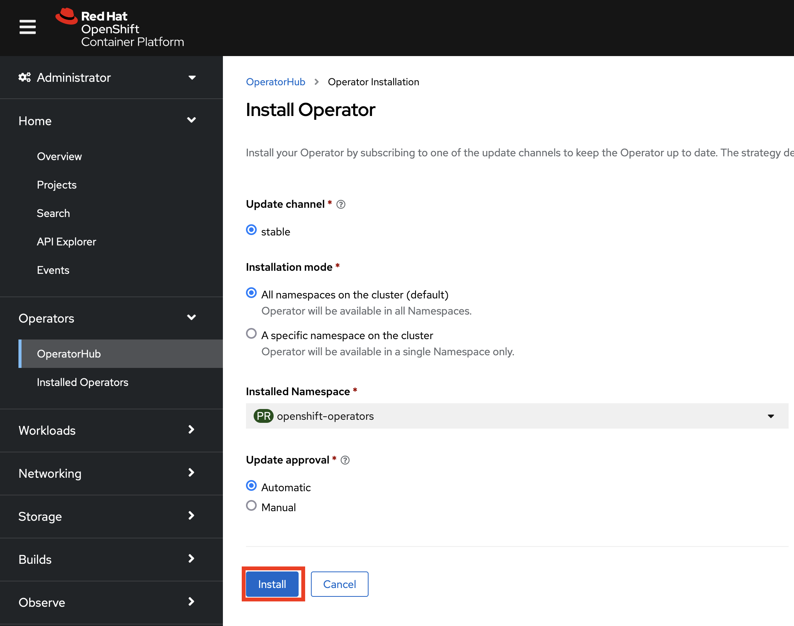
   OpenShift installs the operator and displays a confirmation box once complete a few minutes later.  
9. Click **Installed Operators**, ensuring your new project is selected on top. See the installation has succeeded. Click **Seldon Operator** 
 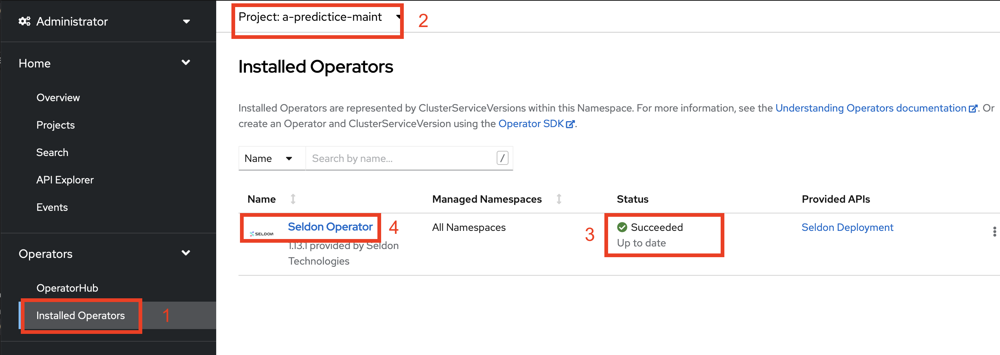

10. Click **Seldon Deployment** then **Create Seldon Deployment**
 

11. On your laptop (or wherever you cloned this repositiory above), navigate to and copy the entire contents of the file **deploy > Seldon-Deployment.yaml**
 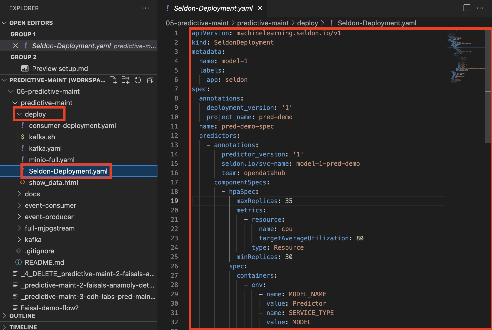

12. Back on OpenShift, choose **YAML view** and replace the default YAML with what you copied in the previous step. Click **Create**
 
 A few minutes this should be complete.


### Install Minio, our lightweight Object Storage implementation


1. In your terminal window, type the following commands:
   ```
   oc apply -f $REPO_HOME/deploy/minio-full.yaml
   ```


### Setup your Minio Object Storage

## Get your Minio URL (Route)
1. In OpenShift, move to **Workloads > Pods**. After a few minutes, both your Minio and Seldon pods should be Running and Ready. (ignore any initial errors for the first couple of minutes - they will work themselves out)


2. Navigate back to **Networking > Routes**. Take a note the OpenShift Route for 
   - the first Minio Route (i.e. the one without ***ui***)
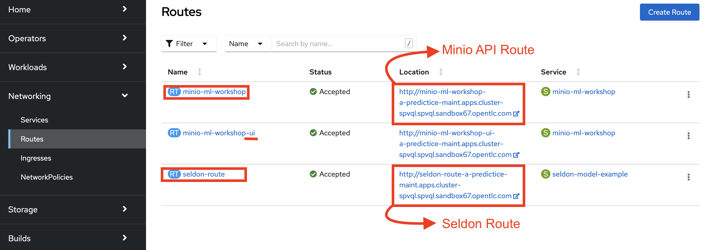

1. We'll need to take note of
   - FULL_MINIO_API_ROUTE - which is your *Minio API Route* from the previous step ***WITH*** the HTTP protocol
   ```
   FULL_MINIO_API_ROUTE
   http://minio-ml-workshop-a-predictice-maint.apps.cluster-spvql.spvql.sandbox67.opentlc.com
   ```
   - MINIO_API_URL - which is your *Minio API Route* from the previous step - ***WITHOUT*** the HTTP protocol
   ```
   YOUR_MINIO_API_URL
   minio-ml-workshop-a-predictice-maint.apps.cluster-spvql.spvql.sandbox67.opentlc.com
   ```
## Change permissions on your Minio S3 bucket to *Public*

1. Navigate to **Netorking > Routes** and click on the second Minio Route, the one with ***ui*** at the end of the name.


2. Enter the credentials 
```
Id:         minio
Password:   minio123
```


3. You'll see a bucket called ***image-prediction***. Click the **Manage** button


4. Click the button beside the *Access Policy* button


5. Change the dropdown to ***public*** and click **Set**


## 5 - Record your Environment Variables
When you later run 
1. your edge based webcam image retrieval client
2. your OpenShift based inference service

you'll need to configure each with various ENVIROMENT variables.

They're summarised here in a generalised format:
```
MINIO_USER="minio"
MINIO_PASSWORD="minio123"
SASL_USERNAME="<SASL_USERNAME recorded above>"
SASL_PASSWORD="<SASL_PASSWORD recorded above>"
KAFKA_BROKER="<YOUR_KAFKA_BOOTSTRAP_SERVER recorded above>"
GROUP_ID="imageclassification"
MINIO_SERVER="<YOUR_MINIO_API_URL recorded above>"
PARALLEL_INFERENCE=30
PROMETHEUS_SERVER=localhost:9090
MODEL_URL="http://model-1-pred-demo:8000/api/v1.0/predictions"
```

And they're summarised here with my specific examples:
```
MINIO_USER="minio"
MINIO_PASSWORD="minio123"
SASL_USERNAME="fe62774f-6308-48d1-954a-d75e43eda326"
SASL_PASSWORD="cfc764aa-8790-4fad-9086-138280dad297"
KAFKA_BROKER="tom-kafka-cbdk-spfgjklbiqle--a.bf2.kafka.rhcloud.com:443"
GROUP_ID="imageclassification"
MINIO_SERVER="minio-ml-workshop-a-predictice-maint.apps.cluster-spvql.spvql.sandbox67.opentlc.com"
PARALLEL_INFERENCE=30
PROMETHEUS_SERVER=localhost:9090
MODEL_URL="export MODEL_URL="http://model-1-pred-demo:8000/api/v1.0/predictions"
```

Take a note of your equivalents substituting the values beginnging with ***YOUR_***. We'll refer to these as ***YOUR_ENVIRONMENT_VARIABLES***


## 6 - Setup Client Application to capture real-time images from your webcam

# TODO - REPLACE WITH VIRTUAL BOX

We need to set up the application on your laptop that captures images in realtime from your webcam and pushes them to the ***vieo-stream*** Kafka topic you created earlier - from which the inferencing application will pull them.

In a terminal on your laptop, install the **Go** programming language if you don't have it already. Instructions here: https://go.dev/doc/install.

In my case on a Mac, I just needed to run:
```
brew install go
brew install opencv
```

Now change directory to the *event-producer* directory in the repo code cloned at the beginning.
```
cd $REPO_HOME/event-producer
```

The final thing you'll need to do before running your client is export five of ***YOUR_ENVIRONMENT_VARIABLES*** from above. Just place the export command in front of each and hit enter. 
```
export SASL_USERNAME="<SASL_USERNAME recorded above>"
export SASL_PASSWORD="<SASL_PASSWORD recorded above>"
export KAFKA_BROKER="<YOUR_KAFKA_BOOTSTRAP_SERVER recorded above>"
```
i.e. in my case:
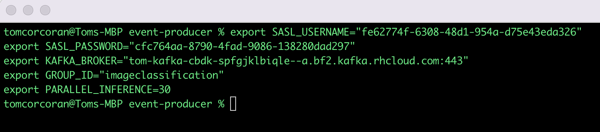

Now your client is ready. We'll use it in the next instruction file, [Run End to End Inference Demo](https://github.com/odh-labs/predictive-maint/blob/main/docs/image-detection-inference-demo.md)


## 7 - Configure your OpenShift inference application to pull images from RHOSAK and make realtime predictions

We have a simple OpenShift based application that 
- pulls images from our video-stream Kafka topic we set up earlier
- for each one, it calls the Model via the MODEL_URL value above (always http://model-1-pred-demo:8000/api/v1.0/predictions) for a prediction on what the image contains
- writes the count of what it found out to our Object Storage Minio
  
We simply need to configure it ***YOUR_ENVIRONMENT_VARIABLES*** that you set up previously.

On your laptop, open the file *consumer-deployment.yaml* in the in *deploy* directory the repo code cloned at the beginning. Move down to line 45 where you'll see placeholders for ***YOUR_ENVIRONMENT_VARIABLES***. Fill them in and **Save the file** (e.g. as shown with mine).
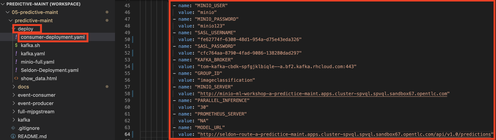

## 8 - Configure your simple HTML dashboard that records a count of the objects it sees

We have a simple HTML page that polls our Minio Object Storage bucket for the count of how many of each item the AI has recorded.

It's this file
```
$REPO_HOME/deploy/show_data.html
```

Open the file using a text editor and change line 7.


i.e. replace ***CHANGE_ME_FULL_MINIO_API_ROUTE*** with your ***FULL_MINIO_API_ROUTE*** retrieved above
```
'[CHANGE_ME_FULL_MINIO_API_ROUTE]/image-prediction/'
```
... in my case 


Now your inference application is ready. We'll use it in the next instruction file, [Run End to End Inference Demo](https://github.com/odh-labs/predictive-maint/blob/main/docs/image-detection-inference-demo.md)
