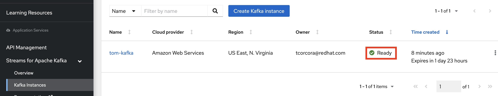
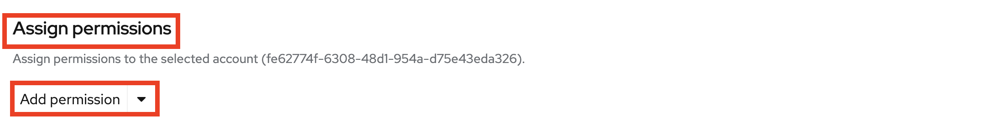

# Setting up the Inference Demo

## 1 - Download the OpenShift CLI

Navigate to [OpenShift CLI Download Page](https://docs.openshift.com/container-platform/4.10/cli_reference/openshift_cli/getting-started-cli.html). (use the newest version - selectable on the top of the page)

Follow the instructions to download the ***oc*** client and add it to your system path.

## 2 - Download the Workshop Files

Using the example below:   
1. Clone (or fork) this repo.
2. Change directory into the root directory of the cloned repository **predictive-maint**.  
3. Create a variable *REPO_HOME* for this directory

```
git clone https://github.com/odh-labs/predictive-maint.git
cd predictive-maint
export REPO_HOME=`pwd`
```


## 3 - Setup Kafka Cluster on Red Hat OpenShift Streams for Apache Kafka (RHOSAK)
First, Login to **https://console.redhat.com** - you may need to create a free account.

Navigate to **Application and Data Services > Streams for Kafka > Kafka Instances**

or just hit:   [https://console.redhat.com/application-services/streams/kafkas](https://console.redhat.com/application-services/streams/kafkas)

### Create Kafka Instance

Click **Create Kafka instance**


Name it, stick with a Single Availability zone and click **Create instance**


Do to the next section (*Create Service Account*) and then come back here - at which point the Status should be **Ready** as seen here:


### Create Service Account

Navigate to **Service Accounts** and click **Create Service Account**


Give your Service Account a description and click **Create**


Copy your *Client ID* and your *Client secret* somewhere safe. We'll refer to these below as YOUR_CLIENT_ID and YOUR_CLIENT_SECRET. Click the tickbox and click ***Close*


### Get your Kafka Bootstrap server details

Navigate to **Application and Data Services > Streams for Kafka > Kafka Instances**, select the Kafka instance you created earlier (in my case tom-kafka), select the Kebab menu, then Details: 


Click the Connection tab and copy your *Bootstrap server*. We'll refer to this below as YOUR_KAFKA_BOOTSTRAP_SERVER (in my case *tom-kafka-cbdk-spfgjklbiqle--a.bf2.kafka.rhcloud.com:443*)


### Create your Kafka topic

Return to the **Kafka Instances** screen and click into your Kafka instance:


Click **Topics** then **Create Topic**


Fill it in ***exactly*** as follows, clicking **Next** between selections and **Finish** at the end
```
Name:		        video-stream
Partitions:	        10
Retention time:         go with the defaults
Retention size:         go with the defaults
Replicas:               go with the defaults
```

### Configure Access

Still within your new Kafka instance, click **Access** then click **Manage Access**


Click the **Account** dropdown and select the new Service Account you created above


Click **Next**


Move to the *Assign permissions* section on the bottom of the window and click **Add permission** (note click the *Add Permission* text, not the dropdown's arrow)


Fill in access details as follows:


Now click **Add permission** (this time ***DO*** click the arrow), choose **Produce to a topic** and fill in as below.

Then click **Add permission** (again this time ***DO*** click the arrow), choose **Consume from a topic** and fill in as below

This is how your permission assigments should now look. Click **Save**


## 4 - Configure OpenShift based object storage (Minio) and model serving (Seldon)

### Login to your OpenShift cluster 
1. Log on to OpenShift as a Cluster Administrator. (For RHPDS this is opentlc-mgr.)
2. Click the *Perspective* dropdown list box
3. Click the *Administrator* perspective\
   OpenShift changes the user interface to the Adminstrator perspective.

4. Click your username on the top right of the screen, then click *Copy Login Command*

5.  Login again with your credentials, Click **Display Token**, copy and paste the token into a terminal window (accepting any insecurity warning)


### Install the Seldon Operator and Seldon Deployment

The Seldon operator is required to expose the model behind a RESTful API.

1. Create a new project using the terminal and delete any limits that get applied to your project. 
***NOTE ask your instructor what your USER value should be***
```
export USER=<ASK INSTRUCTOR>
oc new-project a-predictive-maint-$USER
oc delete limits a-inference-demo-$USER-core-resource-limits
```


2. Click your new project on the GUI

3. Click **Operators > Operator Hub** (ensuring your project is selected on top)
   
   OpenShift displays the operator catalogue.  
4.  Click the *Filter by keybord* text box and type *seldon*  
   OpenShift displays the *Seldon* tile.
5. Click the **Community Seldon Operator**  
   OpenShift displays a Commmunity Operator warning dialog box.
   
6. Click **Continue**  
   OpenShift displays a community operator warning. Accept it by clicking *Continue*.
7. OpenShift displays the operator details. Click **Install**   
      
8. OpenShift prompts for the operator configuration details. Accept all defaults and click **Install**\
 
   OpenShift installs the operator and displays a confirmation box once complete a few minutes later.  
9. Click **Installed Operators**, ensuring your new project is selected on top. See the installation has succeeded. Click **Seldon Operator** 
 

10. Click **Seldon Deployment** then **Create Seldon Deployment**
 

11. On your laptop (or wherever you cloned this repositiory above), navigate to and copy the entire contents of the file **deploy > Seldon-Deployment.yaml**
 

12. Back on OpenShift, choose **YAML view** and replace the default YAML with what you copied in the previous step. Click **Create**
 
 A few minutes this should be complete.


### Install Minio, our lightweight Object Storage implementation


1. In your terminal window, type the following commands:
   ```
   oc apply -f $REPO_HOME/deploy/minio-full.yaml
   ```


### Get your Minio and Seldon URLs (Routes)

1. In OpenShift, move to **Workloads > Pods**. After a few minutes, both your Minio and Seldon pods should be Running and Ready. (ignore any initial errors for the first couple of minutes - they will work themselves out)


2. Navigate to **Networking > Services**. Find the Service whose port is 8000. Take a note of its name, in my case *seldon-model-example*.


3. You now need to expose that Service as a Route. Navigate to **Networking > Routes**, then click **Create Route**


4. Do the following
   - Ensure your new project is selected on top
   - Name your route something like *seldon-route*
   - Select the Service you noted a couple of steps back, in my case *seldon-model-example*
   -  Map port 8000 to 8000 as shown
   - Click **Create**


5. Navigate back to **Networking > Routes**. Take a note the OpenShift Routes for 
   - the first Minio Route (i.e. the one without ***ui***)
   - the Seldon Route. 


6. We'll need 2 URLs from these 
   - MINIO_API_URL - which is your *Minio API Route* from the previous step - ***WITHOUT*** the HTTPS protocol
   - SELDON_INFERENCE_URL - which is the path ***"/api/v1.0/predictions"*** appended to your Seldon Route from the previous step. In my case
   ```
   YOUR_MINIO_API_URL
   minio-ml-workshop-a-predictice-maint.apps.cluster-spvql.spvql.sandbox67.opentlc.com
   ```
   ```
   YOUR_SELDON_INFERENCE_URL
   http://seldon-route-a-predictice-maint.apps.cluster-spvql.spvql.sandbox67.opentlc.com/api/v1.0/predictions
   ```

## 5 - Record your Environment Variables
When you later run 
1. your edge based webcam image retrieval client
2. your OpenShift based inference service

you'll need to configure each with various ENVIROMENT variables.

They're summarised here in a generalised format:
```
MINIO_USER="minio"
MINIO_PASSWORD="minio123"
SASL_USERNAME="<YOUR_CLIENT_ID recorded above>"
SASL_PASSWORD="<YOUR_CLIENT_SECRET recorded above>"
KAFKA_BROKER="<YOUR_KAFKA_BOOTSTRAP_SERVER recorded above>"
GROUP_ID="imageclassification"
MINIO_SERVER="<YOUR_MINIO_API_URL recorded above>"
PARALLEL_INFERENCE=30
PROMETHEUS_SERVER=localhost:9090
MODEL_URL="<YOUR_SELDON_INFERENCE_URL recorded above>"
```

And they're summarised here with my specific examples:
```
MINIO_USER="minio"
MINIO_PASSWORD="minio123"
SASL_USERNAME="fe62774f-6308-48d1-954a-d75e43eda326"
SASL_PASSWORD="cfc764aa-8790-4fad-9086-138280dad297"
KAFKA_BROKER="tom-kafka-cbdk-spfgjklbiqle--a.bf2.kafka.rhcloud.com:443"
GROUP_ID="imageclassification"
MINIO_SERVER="minio-ml-workshop-a-predictice-maint.apps.cluster-spvql.spvql.sandbox67.opentlc.com"
PARALLEL_INFERENCE=30
PROMETHEUS_SERVER=localhost:9090
MODEL_URL="http://seldon-route-a-predictice-maint.apps.cluster-spvql.spvql.sandbox67.opentlc.com/api/v1.0/predictions"
```

Take a note of your equivalents substituting the values beginnging with ***YOUR_***. We'll refer to these as ***YOUR_ENVIRONMENT_VARIABLES***


## 6 - Setup Client Application to capture real-time images from your webcam

# TODO - REPLACE WITH VIRTUAL BOX

We need to set up the application on your laptop that captures images in realtime from your webcam and pushes them to the ***vieo-stream*** Kafka topic you created earlier - from which the inferencing application will pull them.

In a terminal on your laptop, install the **Go** programming language if you don't have it already. Instructions here: https://go.dev/doc/install.

In my case on a Mac, I just needed to run:
```
brew install go
brew install opencv
```

Now change directory to the *event-producer* directory in the repo code cloned at the beginning.
```
cd $REPO_HOME/event-producer
```

The final thing you'll need to do before running your client is export five of ***YOUR_ENVIRONMENT_VARIABLES*** from above. Just place the export command in front of each and hit enter. 
```
export SASL_USERNAME="<YOUR_CLIENT_ID recorded above>"
export SASL_PASSWORD="<YOUR_CLIENT_SECRET recorded above>"
export KAFKA_BROKER="<YOUR_KAFKA_BOOTSTRAP_SERVER recorded above>"
export GROUP_ID="imageclassification"
export PARALLEL_INFERENCE=30
```
i.e. in my case:


Now your client is ready. We'll use it in the next instruction file, [Run End to End Inference Demo](https://github.com/odh-labs/predictive-maint/blob/main/docs/image-detection-inference-demo.md)


## 7 - Configure your OpenShift inference application to pull images from RHOSAK and make realtime predictions

We have a simple OpenShift based application that 
- pulls images from our video-stream Kafka topic we set up earlier
- for each one, it calls the Model via ***YOUR_SELDON_INFERENCE_URL*** for a prediction on what the image contains
- writes the count of what it found out to our Object Storage Minio
  
We simply need to configure it ***YOUR_ENVIRONMENT_VARIABLES*** that you set up previously.

On your laptop, open the file *consumer-deployment.yaml* in the in *deploy* directory the repo code cloned at the beginning. Move down to line 45 where you'll see placeholders for ***YOUR_ENVIRONMENT_VARIABLES***. Fill them in and **Save the file** (e.g. as shown with mine).


Now your inference application is ready. We'll use it in the next instruction file, [Run End to End Inference Demo](https://github.com/odh-labs/predictive-maint/blob/main/docs/image-detection-inference-demo.md)
