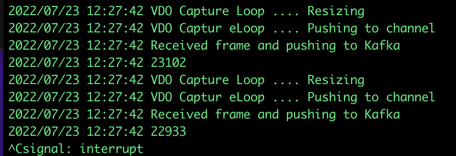

# Running the Inference Demo

Ensure you have setup this demo first, as instructed in [Setup Inference Demo](https://github.com/odh-labs/predictive-maint/blob/main/docs/image-detection-inference-demo-setup.md)

## 1 - Run the Client Application to capture real-time images from your webcam

Go to the terminal you setup in [Setup Client Application to capture real-time images from your webcam](https://github.com/odh-labs/predictive-maint/blob/main/docs/image-detection-inference-demo-setup.md#6---setup-client-application-to-capture-real-time-images-from-your-webcam)

Run the following
```
cd $REPO_HOME/event-producer
go run .
```


This will immediately start pulling images from your webcam and sending them to Kafka. You'll see something like this on your terminal




## 2 - Running the OpenShift inference application to pull images from RHOSAK and make realtime predictions

```
oc apply -f $REPO_HOME/deploy/consumer-deployment.yaml
```

Switch to OpenShift and move to the pods view. In a couple of minutes, you should have a new pod Running and Ready for your inference application. Click the link on the left of the red highlighted box.


Click Logs and you should shortly see multiple inferences being made in realtime - indicating whether it is seeing a person, or a background without a person:


Put your hand in front of your webcam, so it can;t see you. Within a few seconds, the object reported should change from ***Person*** to ***Background***


Next we'll retrain our model so it can recognise objects other than a Person.

To that, move to [Set Up Model Training Demo](https://github.com/odh-labs/predictive-maint/blob/main/docs/image-detection-train-model-demo-setup.md)

