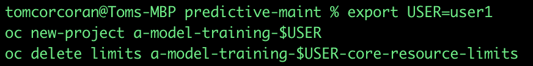
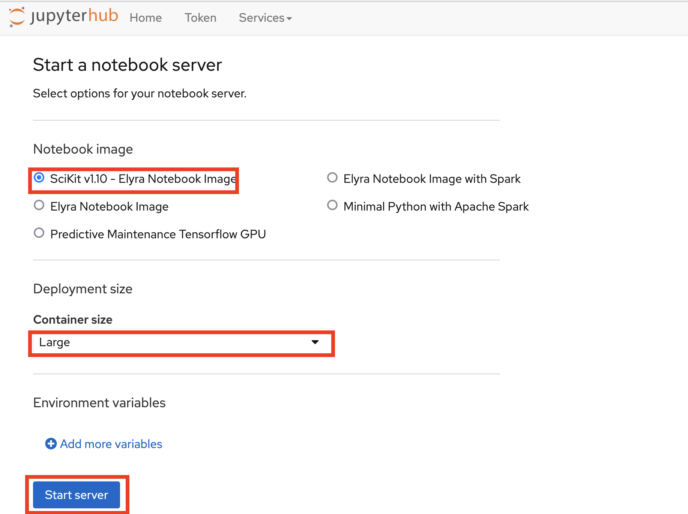
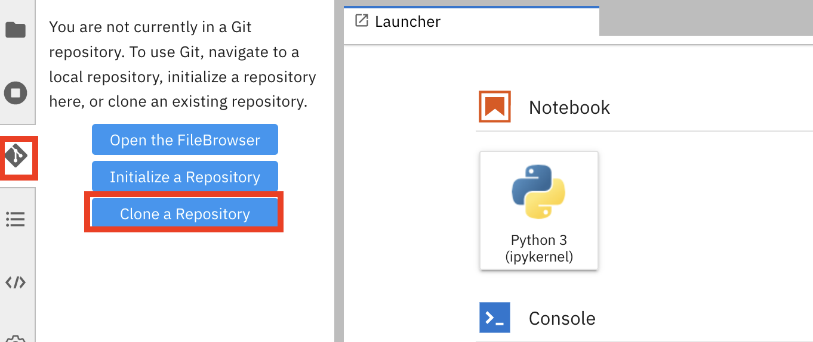

# Setting up the Training Demo

We are going to create, train and deploy an equivalent model we used previously to detect objects in the realtime streaming images from our webcam via Kafka.

## 1 - Create a project and delete any limts

1. Create a new project using the terminal and delete any limits that get applied to your project. 
***NOTE ask your instructor what your USER value should be***
```
export USER=<ASK INSTRUCTOR>
oc new-project a-model-training-$USER
oc delete limits a-model-training-$USER-core-resource-limits
```


2. Click your new project on the GUI


# TODO GET THEM TO INSTALL KFDEF - OR USE THEIR OWN RHODS ON OUR ROSA

3. Click **Operators > Installed Operators** (ensuring your project is selected on top - though your project name will probably be different)


4. Open Jupyter Hub, logging in with your OpenShift credentials and accept the ***Authorize Access*** warning.


5. Select  ***SciKit v1.10 - Elyra Notebook Image***, *Large* Delpoyment Size and Start Server



6. A few minutes later your Jupyter lab will be available. (the first time takes longer as it's doanloading the container image). Click on the Git icon - then click **Clone a Repository**


7. Clone this repo - by entering this in the text box.
```
https://github.com/odh-labs/predictive-maint
```
Now click **Clone**


8. 


